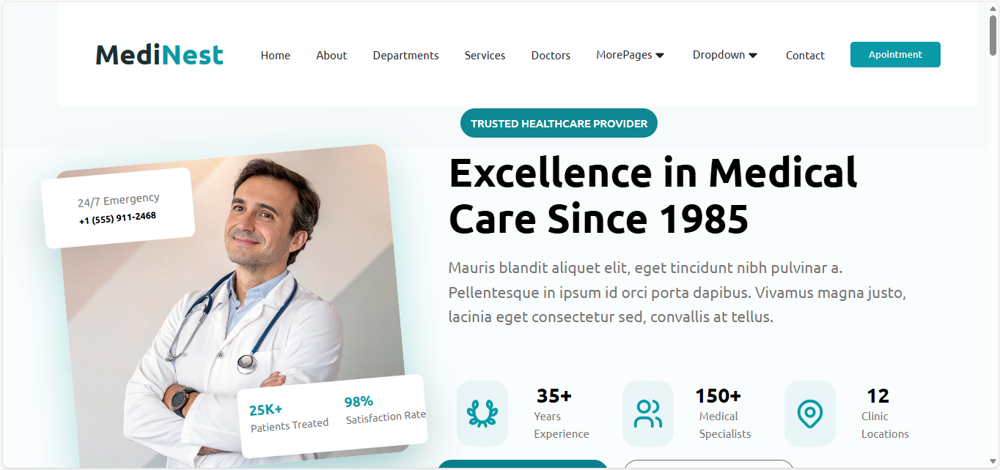

# 🏥 MediNest - Excellence in Medical Care

**MediNest** is a professional healthcare platform designed to showcase medical excellence and provide seamless patient services. From specialized departments to emergency care, MediNest is built to represent a world-class medical institution.

## 🚀 Live Demo


## ✨ Features

* **Premium Navigation**: Clean and responsive header with dropdown menus for easy access to departments and services.
* **Hero Section**: Highlights medical excellence since 1985 with key statistics (25K+ Patients, 98% Satisfaction).
* **Specialized Departments**: Detailed cards for Cardiology, Neurology, Surgery, Pediatrics, Ophthalmology, and Dermatology.
* **Emergency Services**: Dedicated 24/7 emergency response section with quick contact information.
* **Patient Portal**: Quick links for scheduling consultations, live support chat, and medical reports.

## 🛠️ Technologies Used

* **HTML5**: Semantic structure for better SEO and accessibility.
* **CSS3**: Custom styling with a focus on modern typography and responsive layouts.
* **Google Fonts**: Integration of professional fonts like *Roboto* and *Ubuntu*.
* **SVG Icons**: High-quality vector icons for a modern look.

## 📸 Project Preview

> **Note**: This section represents the core parts of the landing page.

* **Trusted Healthcare Provider**: Highlighting verified medical credentials.
* **Excellence Statistics**: Showing years of experience and number of specialists.
* **Interactive Cards**: Visual representation of medical departments with procedure counts.

## 📂 Project Structure

```text
├── public/
│   └── images/      # Hospital and staff imagery
├── style.css        # Main stylesheet
├── index.html       # Landing page structure
└── README.md        # Project documentation